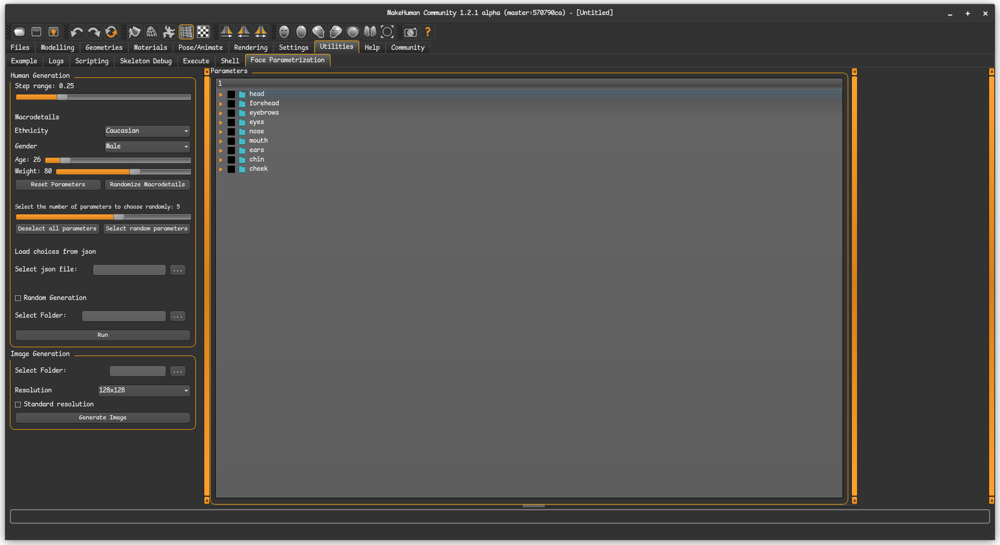

# Makehuman-FaceParametrization
This is a makehuman plugin for my thesis project which serves the purpose to generate, according to the parameters, different humans as a data set for training an AI.

## Installation
The first thing to do is to install the mhapi which can be found [here](https://github.com/makehumancommunity/community-plugins-mhapi), since this plugin depends on it. 
Then it is needed to cloen this repository inside the plugins folder of MakeHuman. At this point it is possible to enable the user plugin thought the MakeHuman UI going in Settings -> User Plugins. In order to let it appear in the UI it is needed to restart the application. The plugin can be found under Utilities -> Face Parametrization.

This plugin also depends on [Blender](https://www.blender.org/) and the plugin [MPFB2](https://static.makehumancommunity.org/mpfb.html) in order to generate the images.

## Usage
When the plugin is activated it appears like the following:

You can create a new human either randomly or by specifying wanted parameters. 

If you choose to define the parameters manually, it's recommended to select no more than 7.  This is because the number of simulated humans generated increases exponentially with each additional parameter. 

Suppose you select 3 parameters and a step value of 0.25. The step value determines the increments between possible parameter values. In this case, each parameter could have 9 possible values ranging from -1 to 1 (in steps of 0.25).

The total number of simulated humans created would be the number of all possible combinations of these parameter values.  Mathematically, this is 9^3 (9 to the power of 3), which equals 729.

In order to generate humans randomly it is needed to check the checkbox "Random Generation". Whne it is activated it will appear a section where it is possible to select the number of humans to generate. If there is no parameter selected in the treeview all the parameters will be included inside the generation. 

In the section "Macrodetails" it is possible to choose some specific parameters which values will be the same for the current generation.

Inside the Image Generation box it is possible to choose where are the files from which the images will be generated. If the files are organised in subfolders it is possible to select the root folder. It is also possible to select a specific resolution or generate it in Full HD check the Standard resolution checkbox. This section depends on Blender and MPFB2.